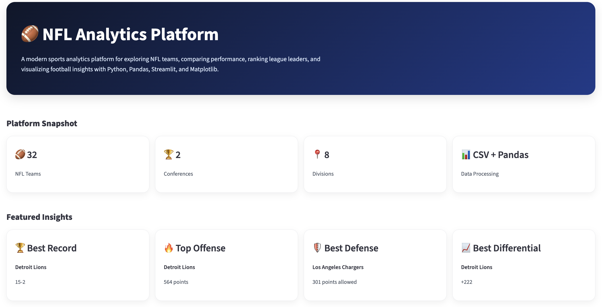
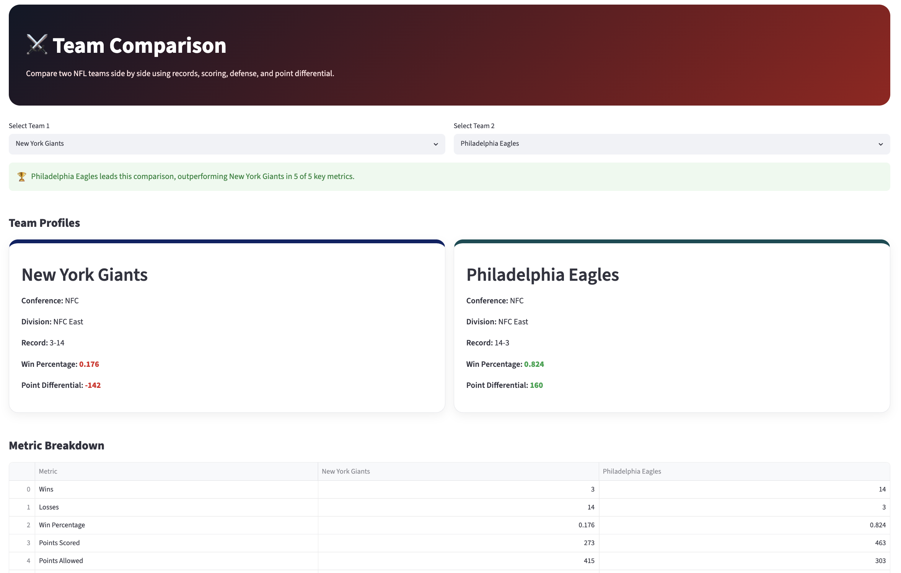
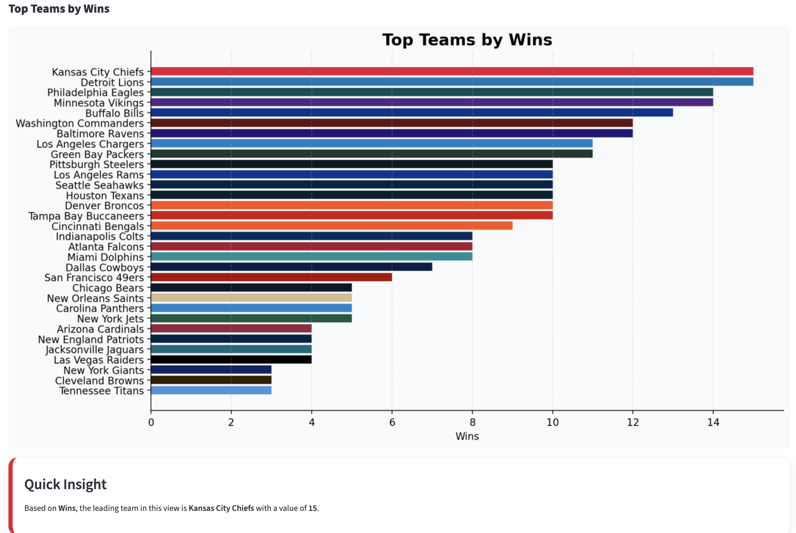
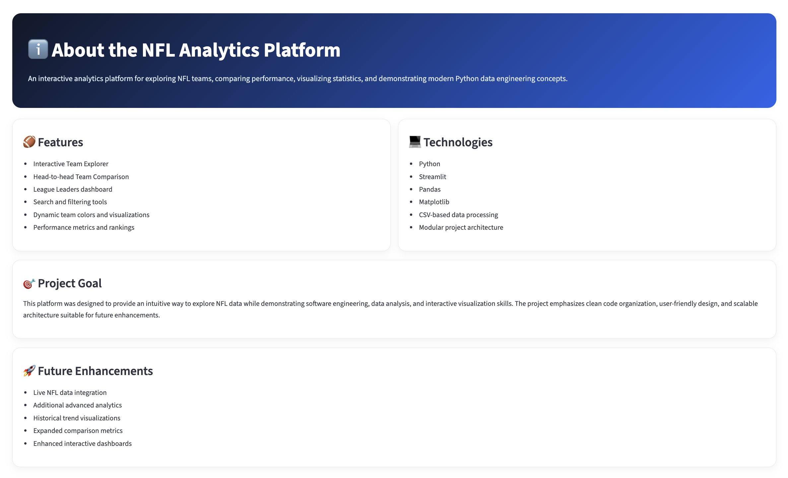

# 🏈 NFL Analytics Platform

A modern, multi-page sports analytics platform built with Python, Pandas, Streamlit, and Matplotlib. This project allows users to explore NFL teams, compare performance metrics, view league leaders, and interact with football data through a clean dashboard-style interface.

## Project Overview

The NFL Analytics Platform was built as a portfolio project to demonstrate data analysis, software engineering, interactive visualization, and user interface design. The platform focuses on making NFL team data easier to explore through searchable filters, comparison tools, leaderboards, and visual insights.

## Features

- Multi-page Streamlit application
- Interactive landing page
- Team Explorer with search, conference, and division filters
- Team Comparison tool with side-by-side analytics
- Winner insight based on key performance metrics
- League Leaders page with sortable rankings
- Dynamic team colors in charts and cards
- Clean, modern dashboard-style UI
- Modular data loading with Pandas

## Tech Stack

- Python
- Streamlit
- Pandas
- Matplotlib
- CSV data processing
- Git and GitHub

## What I Learned

Through this project, I strengthened my understanding of:

- Building interactive web applications with Streamlit
- Loading and transforming data with Pandas
- Creating data visualizations with Matplotlib
- Organizing a multi-page Python project
- Designing a user-friendly analytics interface
- Using Git and GitHub for version control
- Presenting technical projects professionally

## Screenshots

### Home Page


### Team Comparison


### League Leaders


### About Page


## Installation

1. Clone the repository:

```bash
git clone https://github.com/yannirebecca0/nfl-analytics-dashboard.git
```

2. Navigate into the project folder:

```bash
cd nfl-analytics-dashboard
```

3. Install the required packages:

```bash
pip3 install -r requirements.txt
```

4. Run the application:

```bash
streamlit run 🏈_NFL_Analytics_Platform.py
```

## Project Structure

```text
nfl-analytics-dashboard/
│
├── 🏈_NFL_Analytics_Platform.py
├── data_loader.py
├── requirements.txt
├── README.md
├── .gitignore
│
├── data/
│   └── teams.csv
│
├── assets/
│   ├── home.png
│   ├── team-comparison.png
│   ├── league_leaders_2.png
│   └── about.png
│
└── pages/
    ├── 1_📊_Team_Explorer.py
    ├── 2_⚔️_Team_Comparison.py
    ├── 3_🏆_League_Leaders.py
    └── 4_ℹ️_About.py
```

## Future Improvements

- *Currently* working on integrating live NFL data from a public API or data source
- Add official team logos
- Add historical season filtering
- Add player-level statistics
- Build advanced power rankings
- Add trend visualizations across multiple seasons
- Deploy the app online

## Author

Rebecca Yanni

Computer Science Student at Rutgers University–Newark

## Preview

This project was designed to demonstrate interactive data analysis, visualization, and software engineering concepts through NFL statistics. It serves as a flagship portfolio project for technology, data, and specifically sports analytics internship opportunities.
